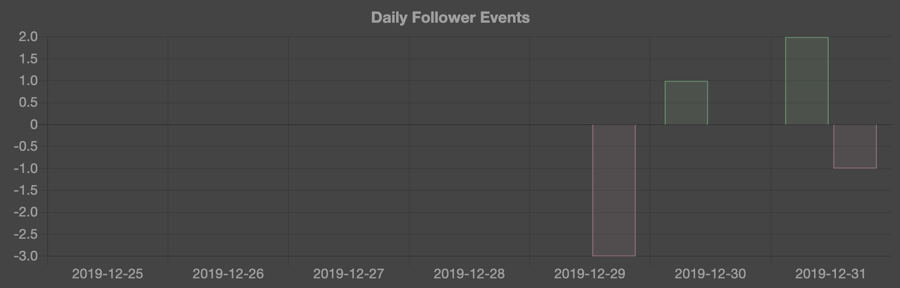
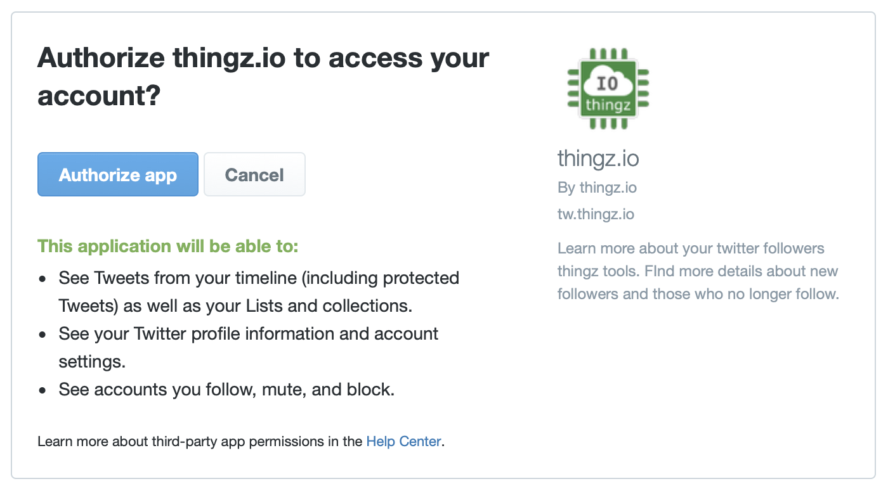

# tweethingz

One of the data points I'm not able to get directly from Twitter is a daily histogram of followers. Sure, there are on-line services that provide that features, but, having used two of them now only to watch each one of them either shut down or start charging for that feature, I decide to write my own.



In addition to the daily histogram of followers I also decided to include the ability to define more advanced search criteria for specific topic on Twitter (e.g. tweets that include links by author who has certain number of follower ratio excluding re-tweets).

## Overview

I set myself three "simple" objectives for this service:

1. Multiple Twitter account support
2. Updated automatically without me needing to check the website
3. Cost-effective when used by 1-2 users and able to scale to 100s of concurrent users if necessary
4. API-based (zero compute, scheduling, or data infrastructure to manage)

I built in using Go on Google's [Cloud Run](https://cloud.google.com/run/) with [Cloud Firestore](https://firebase.google.com/docs/firestore) data persistence and [Cloud Scheduler](https://cloud.google.com/scheduler/) execution ("cron").

> I named the resulting service: `tweethingz` mostly because I already owned `thingz.io` domain... and yes, naming is hard

You can see a live demo of this service at [tw.thingz.io](https://tw.thingz.io/)

## Setup

If you want to deploy your own version of `tweethingz`, you will first need clone this repo:

```shell
git clone https://github.com/mchmarny/tweethingz.git
cd tweethingz
```

Once you clone the repo you can follow the below steps to deploy your own version of `tweethingz`:

### Configuration

The `tweethingz` service exposes a many configuration values but only two are required to edit: Twitter API consumer key and secret (`TW_KEY` and `TW_SECRET` respectively). You can create your own Twitter API credentials [here](https://developer.twitter.com/en/apps/create).

Optionally, you can lock down `tweethingz` service to a list of specific users by defining the `TW_USERS` variable with all the permitted Twitter usernames (separated by space). If left empty, the `tweethingz` will allow all new users to register and use this service.

> Note, every registered user uses their own API access keys once they authorize tweethingz

All of the configuration values are defined in the [bin/config](bin/config) file:

```shell
export TW_KEY="" #Your Twitter API consumer key
export TW_SECRET="" #Your Twitter API consumer secret
export TW_USERS=""
```

### Setup Dependencies

Now that the configuration values are defined, you can setup the service dependencies:

```shell
bin/setup
```

The `setup` script will:

* Enable the necessary GCP APIs (e.g. run, firestore, scheduler etc.)
* Create a secure token for Scheduler to invoke Run service
* Create service account in IAM under which the Run and Scheduler will be running
* and grant that service account the minimum number of the necessary roles (e.g. `run.invoker`)

> As with any script, you should review its content before executing.

### Build Image

Now that the dependencies are set up, you can build the Docker image which will be used to deploy Cloud Run service:

```shell
bin/image
```

If everything goes well you will see something similar to this in your console:

```shell
ID            CREATE_TIME          DURATION  SOURCE                      IMAGES                       STATUS
610bfc9b-...  2019-12-31T22:34:31  1M33S     gs://...cloudbuild/source   gcr.io/.../tweethingz:0.4.9  SUCCESS
```

> Note, if you are familiar with Docker you can build this image locally but you will have to publish it to GCR before it can be deployed into Cloud Run.

### Deploy Service

With the image built, you are now ready to deploy the service to Cloud Run:

```shell
bin/deploy
```

The above script will deploy the previously built image to Cloud Run along with all the necessary configuration and IAM policy bindings. If everything goes OK, you should see response similar to this in your console:

```shell
Deploying container to Cloud Run service [tweethingz] in project [...] region [us-central1]
✓ Deploying... Done.
  ✓ Creating Revision...
  ✓ Routing traffic...
  ✓ Setting IAM Policy...
Done.

Service [tweethingz] revision [tweethingz-00001-man] has been deployed and is serving 100 percent of traffic at https://tweethingz-...-uc.a.run.app
Updated IAM policy for service [tweethingz].
bindings:
- members:
  - allUsers
  - serviceAccount:tweethingz@....iam.gserviceaccount.com
  role: roles/run.invoker
version: 1
```

### Schedule Refresh Worker

The final step in configuring `tweethingz` is to set up Cloud Scheduler so that even when you don't access the Cloud Run service some days your follower histogram will be kept up to date:

```shell
bin/schedule
```

The default frequency for the `tweethingz` update is 30 min. You can change that if you need to in the [bin/config](bin/config) file.

## Usage

The `tweethingz` is pretty much self-explanatory but here are few short steps to guid you

### Authorization

Before you will be able to access Twitter you will have to authorize `tweethingz` to invoke the API on your behalf. Just clock on the "Sign in with Twitter" button on the home page and follow the guide.

> Note, the `tweethingz` service requires only read-only access to your Twitter profile. It uses only the data already available publicly to any of your followers and is unable to post on yur behalf.



## Cleanup

To cleanup all resources created by `tweethingz` execute

```shell
bin/cleanup
```

## Disclaimer

This is my personal project and it does not represent my employer. I take no responsibility for issues caused by this code. I do my best to ensure that everything works, but if something goes wrong, my apologies is all you will get.


